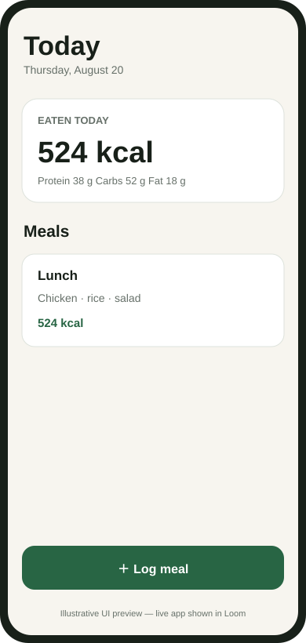
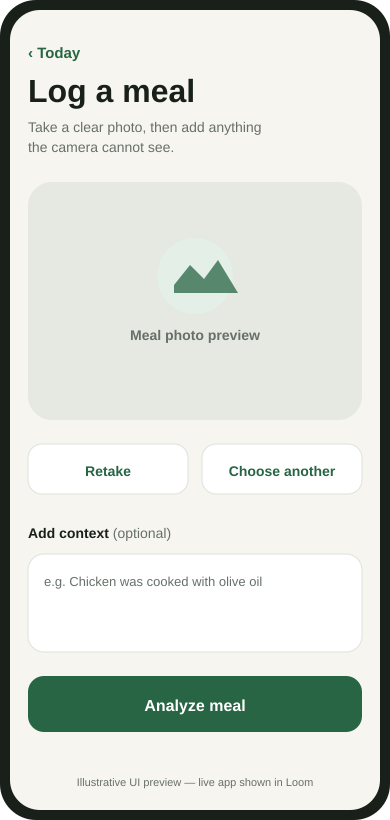
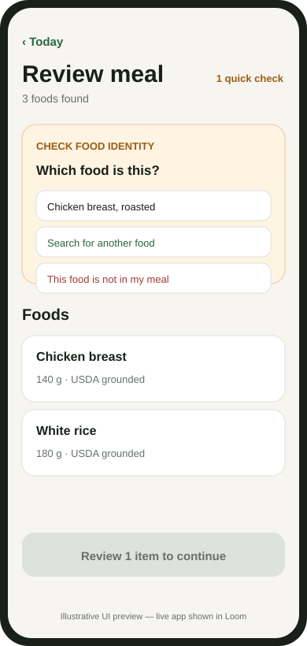
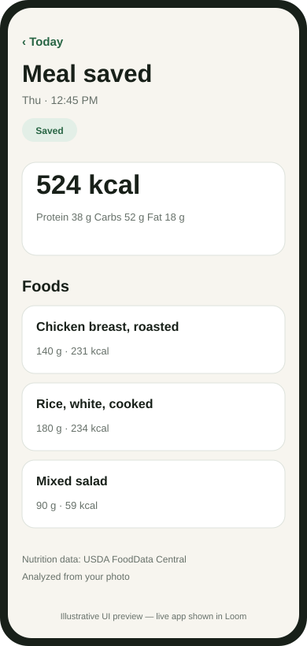

# EatBetter — confidence-aware AI meal logger

A native Expo + FastAPI case study focused on one failure mode: **a confident wrong food or portion silently corrupts the nutrition log**.

The design treats model output as uncertain observation. Food identity is grounded against retrieved USDA candidates, nutrition comes from authoritative detail snapshots, arithmetic is deterministic, and material uncertainty becomes targeted human review instead of a silent guess.

This is a seven-day engineering case study, not a production, clinical, or competitor-validation claim.

## Submission snapshot

| Question | Answer |
|---|---|
| What is the product? | Native mobile meal logging: Today → Capture → Analysis → Review → Confirm → Meal Detail |
| Accuracy strategy | Vision observation → USDA retrieval → constrained SELECT/ABSTAIN selector → deterministic uncertainty/HITL → USDA-grounded nutrition |
| Strongest phone-photo evidence | SNAPMe participant-disjoint recognition holdout: semantic precision **0.853**, recall **0.806**, F1 **0.829** across 10 photos / 36 reviewed visible labels |
| Important limitation | SNAPMe measures visible-food recognition only. It does not validate weighed portions, hidden ingredients, USDA selection, or end-to-end nutrition |
| End-to-end secondary evidence | Nutrition5k exposes unresolved retrieval/clarification limits; its three v2 secondary holdout IDs were already observed under v1 and are retained only for historical comparison—not claimed as a newly untouched holdout |
| Safety trade-off | Prefer selective friction over confidently wrong auto-accept when identity/portion uncertainty can materially change the result |
| Alternative nutrition path | `NUTRITION_PROVIDER` selects `demo`, `usda`, or `ai`. The `ai` path resolves nutrition from the model alone, refuses foods it does not recognize, and marks results `AI_ESTIMATE`. It has unit tests but **no accuracy measurement**, and no number in this repository describes it |
| Production boundary | Persistent runtime repository/storage, production JWT verification, deployment, and monitoring sink are intentionally deferred and staging/production startup fails closed |

### Current verification — 2026-08-20

Latest locally verified state after the canonical `REMOVE_ITEM` recovery work:

- Backend: **156 passed**
- Mobile: **28/28 passed** across 7 suites
- TypeScript: **clean** (`tsc --noEmit`)
- GitHub Actions: submission CI added in this cleanup to run backend, evaluation, mobile tests, and mobile typecheck on pushes/PRs

Historical QA reports keep the test counts that were true when those reports were recorded; they are not rewritten retroactively.

## Mobile experience

The app is a native Expo experience, not a web shell. The client never calculates nutrition or interprets raw confidence; each mutation replaces client state from the backend response.

<table>
<tr>
<td width="25%"></td>
<td width="25%"></td>
<td width="25%"></td>
<td width="25%"></td>
</tr>
<tr>
<td align="center">Today</td><td align="center">Capture</td><td align="center">Review</td><td align="center">Meal Detail</td>
</tr>
</table>

These are **illustrative UI previews derived from the current implementation**, not fabricated emulator captures. The Loom walkthrough is the live app proof. The actual flow has been exercised on an Android SDK emulator with image upload, analysis, clarification, confirmation, and a saved meal.

## Architecture

```text
Meal photo
   ↓
OpenAI vision → strict MealObservation
   ↓
USDA search + deterministic ranking
   ↓
Constrained selector: SELECT supplied rank or ABSTAIN
   ↓
Server validates rank → USDA detail lookup
   ↓
Canonical nutrition snapshot
   ↓
Deterministic uncertainty policy
   ↓
identity → hidden ingredient → portion clarification
   ↓
user correction / recovery
   ↓
Decimal nutrition recalculation → confirm
```

Key authority boundaries:

- Vision cannot provide final nutrition.
- The canonical selector does not receive FDC IDs or nutrition and cannot invent a database identity.
- Search-result nutrition never becomes the final snapshot without detail retrieval.
- `LOW` / `MEDIUM` / `HIGH` are decision categories, not correctness probabilities.
- Confirmation requires every active item to have resolved identity, nutrition, portion provenance, and no blocking clarification.
- Production-like environments are rejected until verified auth, persistent repository, and private object storage exist.

See [architecture](docs/architecture.md), [API contract](docs/api-contract.md), [USDA grounding](docs/usda-grounding.md), [uncertainty and clarification](docs/uncertainty-and-clarification.md), and [mobile UX](docs/mobile-ux.md).

## Accuracy work: experiments and decisions

The evaluation process is intentionally stage-specific. Ground truth is never passed into recognition, retrieval, selection, or clarification generation.

| Experiment / diagnosis | Measured observation | Decision |
|---|---|---|
| Recognition v1 → v2 | Nutrition5k development food F1 **0.286 → 0.615** with retrieval/selector/thresholds held fixed | **Accepted** as the production recognition prompt |
| Semantic retrieval/ranker analysis | Frozen-recognition ablations exposed downstream ranking/selector sensitivity; exact Recall@5 did not improve | Keep as controlled evidence; do not claim a Recall@5 win |
| Selector permutation robustness | Same candidate identities could produce different exact IDs under reranking; exact-ID sensitivity includes near-equivalent candidates | Treat as robustness evidence, not proof of harmful bias |
| Recognition v3 granularity prompt | Mean F1 **57.52% → 49.32%**; all 3 paired repeats regressed despite fewer hallucinations | **Rejected**; production stays on v2 |
| Hidden-ingredient evaluation | Exact hidden identity remained weak while recognition surfaced hidden risk on the measured positive cases; question reachability was blocked upstream | Separate exact identity from risk-surfacing metrics |
| Hidden-risk reachability trace | Both hidden-positive cases were deferred by earlier canonical blockers; no unexplained routing gap | Do **not** change hidden-question stage ordering |
| Clarification recovery trace | 11 unresolved blockers: 5 missing direct-remove recovery, 3 retrieval misses, 2 association/composite cases, 1 unmappable truth | Add direct `REMOVE_ITEM` to candidate clarification; avoid unsafe evaluator relaxation |
| Canonical `REMOVE_ITEM` recovery | User can now resolve a hallucinated candidate-bearing item directly without grounding/model work | **Shipped and regression-tested** |

The rejected v3 prompt is intentionally retained as evidence that iteration was governed by measurements rather than cherry-picked improvements. See [`evals/VISION_PROMPT_ABLATION.md`](evals/VISION_PROMPT_ABLATION.md), [`evals/FROZEN_RECOGNITION.md`](evals/FROZEN_RECOGNITION.md), and [`evals/HIDDEN_RISK_METRICS.md`](evals/HIDDEN_RISK_METRICS.md).

## Measured evidence

### SNAPMe phone-photo recognition

A separate licensed recognition-only evaluation used 30 development and 10 participant-disjoint holdout phone photos. Human review removed diary-only details that were not visually verifiable, and semantic adjudication was performed separately from model execution.

| Split | Strict lexical F1 | Semantic precision | Semantic recall | Semantic F1 |
|---|---:|---:|---:|---:|
| Development: 30 photos / 77 labels | 0.216 | 0.845 | 0.779 | **0.811** |
| Holdout: 10 photos / 36 labels | 0.371 | 0.853 | 0.806 | **0.829** |

The phone-photo result is **recognition-only**. SNAPMe portions/nutrients are dietary-record outputs rather than weighed ground truth, so this benchmark does not support claims about portion estimation, hidden ingredients, nutrition totals, USDA retrieval, canonical selection, or product-level superiority.

### Nutrition5k secondary end-to-end evidence

Nutrition5k provides measured portions and nutrition but uses a custom scanning rig, so it is secondary evidence rather than ordinary phone-capture validation.

The corrected `nutrition5k-public-secondary-v2` contract keeps the same 9 development and 3 historical secondary holdout IDs as v1 while correcting evaluation truth semantics. Because the three holdout IDs had already been observed before v2, **v2 does not describe them as a newly untouched holdout**. A future final holdout requires previously unseen cases.

Historical three-dish secondary holdout results include food F1 **0.353**, USDA Recall@5 **0.333**, and hybrid auto-accept coverage **0%**. The baseline produced totals for two meals but both accepted meals were materially wrong due to missing/incorrect verified foods. The hybrid chose review instead of silent acceptance, but completion/usability remained poor.

Detailed denominators, latency, threshold simulation, limitations, and the historical evidence boundary are in [measured evaluation](docs/measured-evaluation.md). The reproducible protocol is in [`evals/README.md`](evals/README.md).

No clinical, production-level, or numerical “better than EatBetter” claim is made.

## Reliability and observability

- Stable meal lifecycle and ownership-scoped repository access.
- Idempotent meal creation keyed by `(user_id, meal_request_id)`.
- Bounded provider retries with explicit timeout/429/5xx handling.
- Typed provider responses and fail-closed parsing.
- Append-only correction/audit history.
- Correlation IDs via `X-Request-ID` and structured JSON request logs with status and latency.
- AI-run metadata records provider/model/prompt version/status/latency/token usage without exposing secrets.
- Private images and raw benchmark artifacts remain under ignored paths.

The mobile analytics API is deliberately a provider-neutral no-op seam until a privacy-reviewed sink is selected.

## Repository structure

```text
mobile/                    Expo app, screens, typed backend client, tests
backend/app/api/           FastAPI transport contracts
backend/app/application/   meal lifecycle orchestration
backend/app/ai/            strict schemas, providers, versioned prompts
backend/app/domain/        entities, Decimal nutrition, uncertainty policy
backend/app/nutrition/     USDA and AI nutrition providers, parser, normalization, ranking
backend/app/observability/ correlation IDs and structured logging
backend/tests/             unit/integration/provider/contract tests
supabase/migrations/       authoritative PostgreSQL schema and RLS
evals/                     benchmark runners, metrics, frozen experiments
docs/                      architecture, QA, evaluation, walkthrough
```

## Run locally

### Backend

Prerequisites: Python 3.13. Demo mode requires no external credentials; live providers require private OpenAI and USDA keys.

```powershell
cd backend
python -m venv .venv
.\.venv\Scripts\Activate.ps1
pip install -r requirements-dev.txt
Copy-Item .env.example .env
uvicorn app.main:app --reload
```

Run backend tests:

```powershell
.\.venv\Scripts\python.exe -m pytest tests -q
```

OpenAPI: `http://127.0.0.1:8000/docs`.

### Mobile

Prerequisites: Node.js 20+ and npm. A physical phone must point `mobile/.env` to the development computer's LAN address rather than `127.0.0.1`.

```powershell
cd mobile
Copy-Item .env.example .env
npm install
npm start
```

Verification:

```powershell
npm test
npm run typecheck
npx expo-doctor
```

### Evaluation tests

From repository root with backend dependencies installed:

```powershell
.\backend\.venv\Scripts\python.exe -m pytest evals\tests -q
```

Do not regenerate frozen recognition fixtures or tune against already-inspected holdout cases. See [`evals/README.md`](evals/README.md).

## Data, privacy, and production boundary

- Credentials remain server-side; `.env`, private meal photos, raw benchmark runs, and service-role secrets must never be committed.
- Uploaded image MIME/signature/size are validated and original filenames are not trusted as storage keys.
- PostgreSQL/Supabase schema and RLS are defined, but the case-study runtime intentionally uses in-memory repository/storage adapters.
- Development bearer tokens are fixtures, not deployable authentication.
- Staging/production startup fails closed until production JWT, persistent repository, and private object storage adapters exist.
- Deployment, monitoring backend integration, backups, incident response, physical-device QA, and product-specific owned/consented weighed evaluation remain deferred.

See [project status](docs/project-status.md), [QA closeout](docs/qa-closeout-2026-08-19.md), and [security policy](SECURITY.md).

## AI-tool disclosure

OpenAI Codex was used as an implementation and analysis assistant for scaffolding, code, tests, documentation, and evaluation tooling. Human review remained authoritative for visible-food labels, uncertainty exclusions, semantic adjudication, scope decisions, and final claims. Generated work was validated through deterministic tests, frozen configurations, manual review, and explicit evidence boundaries.

## Submission

- Technical write-up: this README + linked evidence docs
- Live app walkthrough: follow [`docs/WALKTHROUGH.md`](docs/WALKTHROUGH.md)
- Email summary: [`docs/EMAIL_SUMMARY.md`](docs/EMAIL_SUMMARY.md)
- Exact implemented/deferred boundary: [`docs/project-status.md`](docs/project-status.md)
